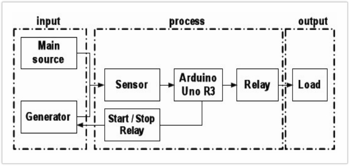

# Arduino Uno-Based Automatic Transfer Switch (ATS)

This mini project demonstrates an **Automatic Transfer Switch (ATS)** using an **Arduino Uno (ATmega328)** microcontroller to automatically switch between main power and a backup generator when a failure occurs.

---

## ⚙️ Features

- Real-time voltage monitoring
- Automatic source switching between main and backup
- Relay control using Arduino
- Compact and reliable design for critical power continuity

---

## 📸 Circuit Diagram & Images

### 🔌 ATS Block Diagram
 

---

## 🧰 Components Used

- Arduino Uno R3 (ATmega328)
- Voltage sensors (AC or DC sensing modules)
- 3-Channel or 4-Channel Relay Module
- Wires and Power Supplies
- Load simulation lamp/fan

---

## 🧠 Working Principle

1. Arduino continuously monitors the main power input.
2. If a power failure is detected (voltage drops below threshold), it switches the load to the generator using relay logic.
3. Once the main power returns, the Arduino switches the load back automatically.
4. Relays ensure safe, isolated switching between sources.

---

## 💡 Applications

- Smart Homes
- Small Industries
- Hospitals and Clinics
- Renewable Power Backup Systems
- Emergency Lighting Systems

---

## 📂 Folder Structure

Arduino-ATS-Project/
├── README.md
├── code/
│   └── main.ino
├── images/
│   ├── Block_Diagram.png
│   ├── Circuit_Diagram.png
│   ├── model1.png
│   └── model2.png

---
## 👨‍💻 Project Contributors
- **Nishanth Y**
- Arunank H M  
- Jeetendra Maharshi  

---

## 📜 License

This project is for educational use under the curriculum of SJCE, JSS STU Mysuru.

---
